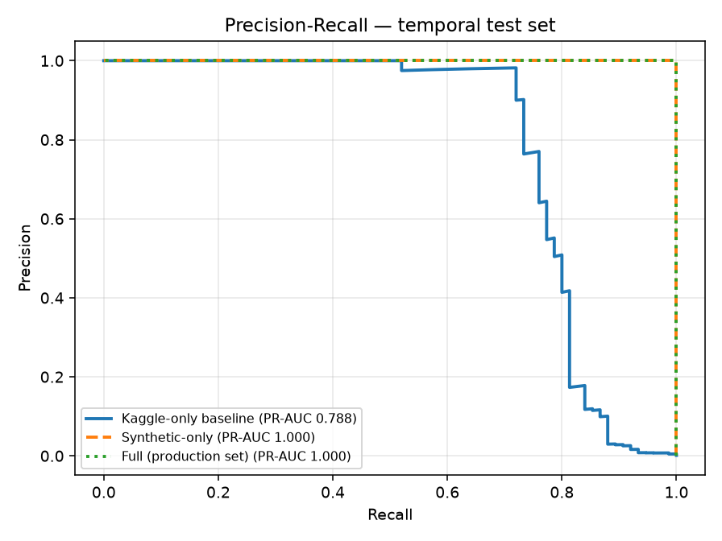
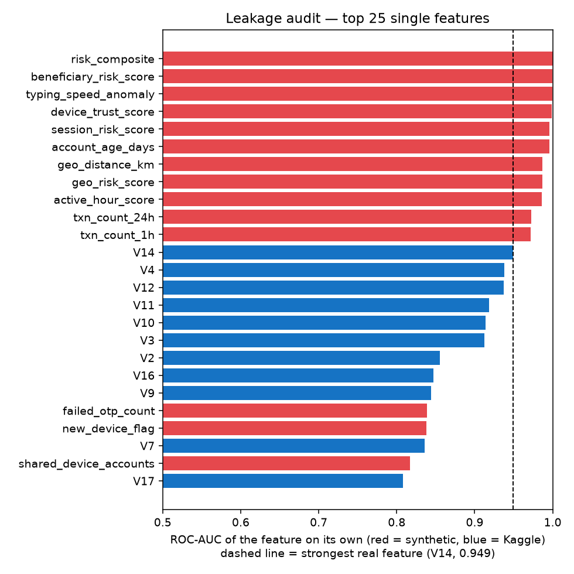
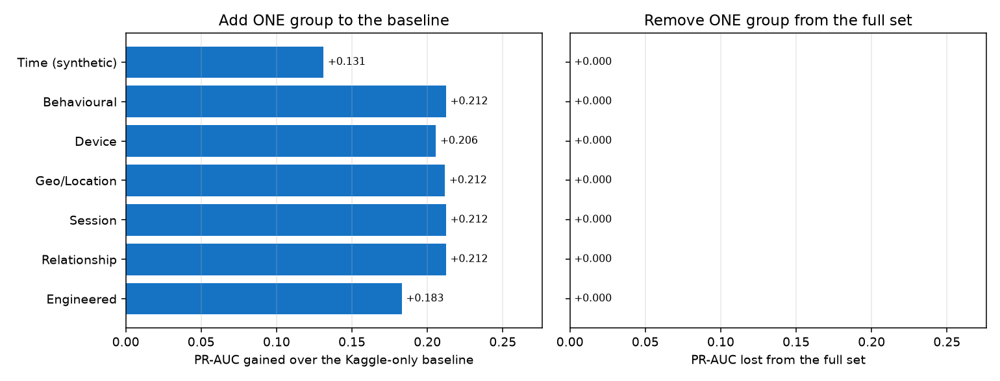

# 🛡️ PaymentGuardian — Real-Time Payment Fraud Protection

> PaymentGuardian is a fraud-prevention engine that sits **on top of** a bank's existing
> systems as an intelligent **trust layer**. For every digital payment it checks
> the transaction, the device, the customer's history, the receiver's reputation,
> and a shared fraud memory — then produces a single **TTI (0–100)** and a
> decision: **Approved · Risky (verify) · Blocked**.
>
> Built for the Indian Overseas Bank (IOB) problem statement.
> The mock payment app is branded **"IOB Pay"**; the fraud engine behind it is **PaymentGuardian**.

### Project goal (fixed — every change must preserve this)

> **Stop fraudulent digital payments (APP fraud, mule accounts, first-time
> beneficiary scams) in real time by adding an explainable trust layer on top of
> the bank's existing systems — scoring every payment with one TTI (0–100) and
> deciding Approved / Risky / Blocked, while learning from every confirmed fraud.**
>
> Every improvement in the [Improvement plan](#20-improvement-plan) is checked
> against this sentence. Anything that changes *what* the system does for a
> payment (the six checks, the TTI, the three decisions, the feedback loop) is
> out of scope; improvements may only make it **more rigorous, more honest,
> or better presented**.

This README explains **everything** — the idea, the data, the models, every
feature, the database, the "blockchain", every API, and the whole user interface —
in plain language, so you can understand and present it confidently.

---

## 📑 Table of contents
1. [The problem & the idea](#1-the-problem--the-idea)
2. [Glossary — words you'll see](#2-glossary--words-youll-see)
3. [How it works (architecture)](#3-how-it-works-architecture)
4. [Step-by-step workflow](#4-step-by-step-workflow)
5. [Project structure](#5-project-structure)
6. [Tech stack](#6-tech-stack)
7. [The database (SQLite)](#7-the-database-sqlite)
8. [The dataset](#8-the-dataset)
9. [The features (all 57)](#9-the-features-all-57)
10. [The models](#10-the-models)
11. [The TTI (how the decision is made)](#11-the-tti-how-the-decision-is-made)
12. [Why the AI "fraud probability" looks like 0% or 100%](#12-why-the-ai-fraud-probability-looks-like-0-or-100)
    - [12b. Model evaluation & results](#12b-model-evaluation--results)
13. [TTI vs Customer Trust (two different numbers)](#13-tti-vs-customer-trust)
14. [The "blockchain" — the honest truth](#14-the-blockchain--the-honest-truth)
15. [API reference](#15-api-reference)
16. [The dashboard (analyst console)](#16-the-dashboard-analyst-console)
17. [The IOB Pay simulator](#17-the-iob-pay-simulator)
18. [How to run it](#18-how-to-run-it)
19. [Demo script](#19-demo-script)
20. [Improvement plan](#20-improvement-plan)
21. [Roadmap](#21-roadmap)
22. [FAQ](#22-faq)

---

## 1. The problem & the idea

**The problem.** Banks lose money to fraud that rule-based systems miss —
especially:
- **APP fraud** (Authorized Push Payment): the customer is *tricked* into sending
  money themselves. The login and OTP are all genuine, so it's hard to catch.
- **Mule accounts**: accounts used to receive and move stolen money.
- **First-time beneficiary scams**: money sent to a receiver never paid before.

Rules are rigid, cause false alarms, and have no memory or shared intelligence.

**The idea.** Don't replace the bank's engine — add a smart **trust layer**. For
each payment, PaymentGuardian asks six questions:
1. Does the AI model think this transaction looks fraudulent?
2. Is the device trustworthy (new? rooted? emulator?)?
3. How has this customer behaved historically?
4. Is the **receiver** known-good or known-bad?
5. Did authentication go smoothly (OTP failures, pasted account numbers)?
6. Has our **shared fraud memory** seen this receiver/device before?

It blends those into **one TTI (0–100)** and decides. Crucially it
**learns**: when a fraud is blocked, the receiver/device is remembered, so the
**next** payment to that same account is caught instantly — even if it looks clean.

---

## 2. Glossary — words you'll see

| Term | Plain meaning |
|---|---|
| **TTI (Transaction Trust Index)** | The final 0–100 risk score for one payment. Higher = riskier. Shown as "TTI" in the app. |
| **Customer Trust** | A 0–100 reputation for the *customer*, built over their history. Higher = more trusted. **Different from TTI.** |
| **APP fraud** | Victim is socially engineered into paying a scammer themselves. |
| **Mule account** | A bank account used to launder stolen money. |
| **Beneficiary** | The *receiver* of a payment. |
| **Reputation ledger** | Our shared memory of known-bad receivers/devices (risk score per entity). |
| **Feedback loop** | When a payment is Blocked, its receiver/device is remembered so future payments to it are caught. |
| **SHAP** | A method that explains *which features* drove the AI's decision (for compliance). |
| **Step-up / MFA** | For "Risky" payments, ask for an extra check (another OTP) instead of approving or blocking. |
| **Decision** | One of: **Approved**, **Risky** (verify with OTP), **Blocked**. |

---

## 3. How it works (architecture)

```
     ┌───────────────────────────────────────────────────────────┐
     │   IOB Pay app  /  UPI  /  Card  /  Wallet   (payment)      │
     └───────────────────────────┬───────────────────────────────┘
                                  │  HTTP POST /score  (JSON)
                                  ▼
     ┌───────────────────────────────────────────────────────────┐
     │              PaymentGuardian Backend  (api/main.py)               │
     │                                                            │
     │  1) Build 57-feature vector  →  scale                      │
     │  ┌──────────────────────────────────────────────────────┐ │
     │  │ LightGBM        → fraud probability                  │ │
     │  │ Isolation Forest→ anomaly score                      │ │
     │  │ SHAP            → explanation                         │ │
     │  └──────────────────────────────────────────────────────┘ │
     │  2) Dynamic Trust Engine → Customer Trust                  │
     │  3) Reputation ledger lookup → receiver / device risk      │
     │  ┌──────────────────────────────────────────────────────┐ │
     │  │   TTI (Transaction Trust Index) = blend of 6 checks  │ │
     │  └──────────────────────────────────────────────────────┘ │
     │  4) Decision: Approved / Risky / Blocked                  │
     │  5) Ledger override (confirmed-fraud entity escalates)    │
     │  6) On Block → remember receiver/device (feedback loop)   │
     │  7) Save everything to SQLite  +  live feed               │
     └───────────────────────────┬───────────────────────────────┘
              ┌──────────────────┼───────────────────┐
              ▼                  ▼                    ▼
     ┌─────────────────┐  ┌──────────────┐   ┌──────────────────┐
     │ SQLite database │  │ Streamlit    │   │ IOB Pay app      │
     │ (durable state) │  │ dashboard    │   │ (React, /pay)    │
     └─────────────────┘  └──────────────┘   └──────────────────┘
```

There are **three programs**: the **PaymentGuardian API** (the brain), the **Streamlit
dashboard** (what a fraud analyst sees), and the **IOB Pay app** (a mock payment
screen). The API also saves everything to a **SQLite database** so nothing is lost
on restart.

---

## 4. Step-by-step workflow

1. **Customer makes a payment** (from IOB Pay or any channel).
2. **Backend gathers details** — amount, time, device, location, session
   behaviour, receiver ID.
3. **Receiver reputation is checked** in the ledger.
4. **AI scores it** — LightGBM (fraud probability) + Isolation Forest (anomaly).
5. **TTI is computed** by blending 6 checks.
6. **Decision** — Approved / Risky (verify) / Blocked, with a ledger override.
7. **SHAP explains** the decision.
8. **On Block**, the receiver/device is remembered (feedback loop), a compliance
   **STR report** is generated, and everything is **saved to SQLite**.

---

## 5. Project structure

```
fraud-demo/
├── data/
│   ├── creditcard.csv            ← Kaggle base dataset (284,807 payments)
│   ├── generate_synthetic.py     ← Adds 25+ behavioural features → enriched CSV
│   ├── enriched_fraud_data.csv   ← Generated training data (57 features)
│   └── paymentguardian.db               ← SQLite database (created automatically)
├── models/
│   ├── train_pipeline.py         ← Trains LightGBM + Isolation Forest + SHAP
│   ├── evaluate.py               ← Evaluation & leakage audit (does NOT touch the .pkl models)
│   ├── reports/                  ← evaluation_report.md, evaluation_results.json, charts
│   ├── trust_engine.py           ← Dynamic Trust Engine (customer trust)
│   ├── reputation.py             ← Reputation ledger (receiver/device memory)
│   ├── db.py                     ← SQLite persistence layer
│   └── *.pkl                     ← Trained models + settings
├── api/
│   └── main.py                   ← PaymentGuardian backend (FastAPI)
├── dashboard/
│   └── app.py                    ← Analyst dashboard (Streamlit)
├── iobpay/
│   └── index.html                ← IOB Pay simulator (React, served at /pay)
├── requirements.txt
└── README.md                     ← This file
```

**Who talks to whom:** `api/main.py` loads the models and imports
`trust_engine.py`, `reputation.py`, and `db.py`. The **dashboard** and the **IOB
Pay app** are pure clients — they only call the API over HTTP.

---

## 6. Tech stack

| Layer | Technology | Why |
|---|---|---|
| Main AI model | **LightGBM** | Fast, handles rare-fraud imbalance, explainable. |
| Anomaly model | **Isolation Forest** | Unsupervised — catches *novel* fraud. |
| Explainability | **SHAP** | Regulators require explaining *why* a payment was blocked. |
| Customer trust | **Dynamic Trust Engine** (custom) | Scores the customer over time, not just one payment. |
| Fraud memory | **Reputation ledger** (custom) | Shared receiver/device intelligence. |
| Backend API | **FastAPI** | Async, auto docs (`/docs`), input validation. |
| Database | **SQLite** (built-in `sqlite3`) | Durable storage, zero setup. |
| Dashboard | **Streamlit + Plotly** | Fast, Python-native, interactive charts. |
| Payment app | **React** (via CDN) | Single-file mock payment screen, no build step. |
| Data | **pandas + NumPy** | Feature engineering + synthetic data. |
| Model storage | **joblib** | Saves/loads trained models (`.pkl`). |

> **Production stack (roadmap):** React analyst console, PostgreSQL, Redis,
> Docker, real Hyperledger Fabric, Grafana. See §20.

---

## 7. The database (SQLite)

PaymentGuardian uses a **SQLite database** at `data/paymentguardian.db` (created automatically on
first run — no setup needed). It uses Python's **built-in** `sqlite3`, so there's
**no extra dependency** to install.

**Why:** without it, everything reset every time the API restarted. Now the things
PaymentGuardian *learns* survive restarts. Three tables:

| Table | What it stores |
|---|---|
| `reputation` | The fraud memory — each known-bad receiver/device with its risk. |
| `customers` | Each customer's trust score and history counters. |
| `transactions` | Every scored payment (powers the live feed and analytics). |

**How it flows:** on startup the API loads the ledger, customer trust, and recent
transactions from SQLite. Every time a payment is scored or a fraud is remembered,
the change is written back. **Verified:** stop the API, restart it — the ledger,
customer trust, and feed are all still there.

To wipe everything and start fresh, just delete `data/paymentguardian.db`.

> **Why SQLite and not PostgreSQL?** The PRD names PostgreSQL for large-scale
> production. SQLite gives the *same durability* with zero setup, which is the
> right choice at this stage. Swapping to PostgreSQL later is straightforward
> because all database code lives in one file (`models/db.py`).

---

## 8. The dataset

Two layers of data.

### 8a. Base: Kaggle Credit Card Fraud dataset
- **284,807 payments**, of which **492 are fraud (0.172 %)** — very imbalanced
  (~**577 legit : 1 fraud**).
- Columns: `Time`, `Amount`, `Class` (0/1 label), and **V1–V28** — anonymised
  **PCA-transformed** signals (we can't know what each means; they're compressed).

### 8b. Enrichment: synthetic behavioural features (`generate_synthetic.py`)
The Kaggle data has no device/location/session signals — but real fraud is caught
by exactly those. So we **create 25+ realistic features**, generated based on the
fraud label using published fraud patterns (RBI, FATF).

**What the patterns are based on:** each feature reproduces a published fraud
pattern. Example — `new_device_flag`: fraud rows are on a new device 75 % of the
time, legit rows only 8 %, mirroring the fact that fraudsters use fresh devices.

**Known limitation (measured, see §12b):** because every value is drawn *from the
fraud label*, the simulated patterns are much cleaner than real data. Several
features separate fraud almost perfectly on their own (e.g.
`beneficiary_risk_score` has a single-feature ROC-AUC of 0.9999), so any model
trained on them scores ≈ 1.0. The enrichment demonstrates the *pipeline*; it does
not prove real-world accuracy. Making the data realistic is task T2 in §20.

Output: `enriched_fraud_data.csv` — the 284,807 rows with the full feature set.

---

## 9. The features (all 57)

The model uses **57 features**.

- **PCA (28):** `V1`–`V28` — anonymised signals from Kaggle.
- **Time (3):** `hour`, `day_of_week`, `active_hour_score` (is it the user's normal hours?).
- **Behavioural (5):** `avg_txn_amount`, `amount_deviation` (amount ÷ average),
  `txn_frequency`, `txn_count_1h`, `txn_count_24h`.
- **Device (4):** `new_device_flag`, `rooted_device`, `emulator_detected`,
  `device_trust_score`.
- **Location (5):** `geo_distance_km`, `impossible_travel` (moved >500 km in <1 h),
  `vpn_detected`, `is_international`, `geo_risk_score`.
- **Session (6):** `session_duration_sec`, `paste_detected` (account number pasted,
  not typed), `failed_otp_count`, `beneficiary_added_recently`,
  `typing_speed_anomaly`, `session_risk_score`.
- **Relationship (3):** `shared_device_accounts` (mule-ring signal),
  `beneficiary_risk_score`, `account_age_days`.
- **Engineered (3):** `log_amount`, `amount_zscore`, `risk_composite`.

**Most important features** (from the trained model): `beneficiary_risk_score` ›
`account_age_days` › `risk_composite` › `typing_speed_anomaly` › `txn_count_1h`.
In other words, **who you're paying and how new they are** matter most — exactly
the APP/mule fraud we target.

---

## 10. The models

### 10a. LightGBM — main fraud classifier
- **What:** a gradient-boosted decision-tree model that outputs a **fraud
  probability (0–1)**.
- **Why LightGBM:** fast inference, handles the 577:1 imbalance natively, explainable.
- **Tuned parameters** (found by GridSearchCV, 3-fold, optimising F1):

  ```
  n_estimators=300   learning_rate=0.05   max_depth=5   num_leaves=31
  subsample=0.8      colsample_bytree=0.8  min_child_samples=30
  reg_alpha=0.1      reg_lambda=1.0        is_unbalance=True
  ```

### 10b. Isolation Forest — anomaly detection
- **What:** an *unsupervised* model that scores how *unusual* a payment is,
  ignoring the label.
- **Why:** LightGBM only knows patterns it was trained on. Isolation Forest catches
  **new / never-seen** fraud shapes. Uses 28 behavioural features.

### 10c. SHAP — explainability
- **What:** for each decision, shows which features pushed the score **up** or
  **down**.
- **Why:** RBI compliance — you must justify a block.

### 10d. Dynamic Trust Engine (`trust_engine.py`)
- **What:** a **per-customer trust score (0–100)** that **drops** on suspicious
  activity and **recovers slowly** with good behaviour.
- **Why it's special:** most systems score *transactions*. This scores the
  **customer over time** — like a bank's real view of a client. Its score becomes
  the "Customer History" check inside the TTI.

### 10e. Reputation ledger (`reputation.py`)
- **What:** the **fraud memory** — a risk score (0–100) for each receiver and
  device, seeded with known-bad entities (e.g. `BENF-MULE-001`).
- **Methods:** `lookup` (read), `report_fraud` (write — the feedback loop),
  `observe`. Stores only IDs + risk, no personal data. Backed by SQLite.

---

## 11. The TTI (how the decision is made)

The TTI turns six checks into **one 0–100 number** (higher = riskier).

### The six checks and their weights
| # | Check | Weight | Comes from |
|---|---|---|---|
| 1 | **Transaction Risk** | 0.35 | LightGBM + Isolation Forest |
| 2 | **Device Trust** | 0.15 | Device signals |
| 3 | **Customer History** | 0.15 | Dynamic Trust Engine + amount/velocity |
| 4 | **Receiver Reputation** | 0.15 | Ledger lookup (first-time = premium) |
| 5 | **Authentication** | 0.10 | Failed OTPs + pasted account number |
| 6 | **Shared Fraud Memory** | 0.10 | Worst ledger risk of receiver/device |

**TTI = Σ (check × weight).** The dashboard shows every check's score and
contribution, so nothing is hidden.

### The decision
| TTI | Decision | Meaning |
|---|---|---|
| **Under 35** | ✅ **Approved** | Looks safe — let it through. |
| **35 – 70** | ⚠️ **Risky** | Not sure — ask for an extra OTP (step-up MFA). |
| **70+** | ⛔ **Blocked** | Almost certainly fraud — stop it. |

**Why the middle band asks for MFA:** it's the "unsure" zone. Blocking everyone
here annoys real customers (false alarms); approving everyone lets fraud through.
So we ask for one more proof of identity. **Not every payment is MFA** — only the
middle band. Safe payments are approved instantly; clear fraud is blocked outright.

### Ledger override (safety net)
A confirmed-fraud receiver/device **overrides** the score: ledger risk ≥ 70 forces
**Blocked**, ≥ 40 forces at least **Risky**. It never downgrades a decision.

### Feedback loop (learning)
On a **Block**, PaymentGuardian remembers the receiver (+75) and device (+45) in the
ledger. So the **next** payment to that receiver is caught automatically — even if
it looks perfectly clean. (The lookup happens *before* the write, so a payment is
never punished by its own fingerprint — only by earlier fraud.)

---

## 12. Why the AI "fraud probability" looks like 0% or 100%

You'll notice the raw **fraud probability** is almost always **0.0 % or 100 %**,
rarely in between. **This is expected, not a bug.**

**Reason:** our synthetic features separate fraud from legit *very* sharply (e.g.
device trust ≈ 25 for fraud vs ≈ 82 for legit; VPN 65 % vs 4 %). With ~20 such
clean features, LightGBM can tell the classes apart almost perfectly, so it becomes
**very confident** and outputs probabilities near 0 or 1. Real bank data overlaps
much more, so probabilities would spread out. (The model's tuned threshold is
0.9998, which only happens when it's this confident.) The evaluation in §12b
measures this directly: 11 synthetic features, *each on its own*, separate fraud
better than the strongest real Kaggle feature (V14, ROC-AUC 0.949).

**Why it doesn't matter for the decision:** the number that drives the decision is
the **TTI**, and that is **not** binary — it blends 6 checks (including the
continuous anomaly score), so it spreads nicely: e.g. **19 → 39 → 76 → 89** across
normal → borderline → risky → fraud payments.

**If you want realistic-looking probabilities:** regenerate the synthetic data with
*overlapping* distributions and retrain (~10 min). Probability calibration alone
won't help, because the classes really are separable. This is planned as task T2
(§20), and §12b shows what to expect: the honest Kaggle-only baseline.

---

## 12b. Model evaluation & results

`models/evaluate.py` measures what the fraud model can and cannot claim. It only
**reads** the data. It never overwrites the production `.pkl` models, so the API,
dashboard and IOB Pay behave exactly as before. Full tables and charts are in
[models/reports/evaluation_report.md](models/reports/evaluation_report.md).

**Setup.** All 284,807 payments (492 fraud). **Temporal split:** train on the
first 64 % of time, choose the decision threshold on the next 16 %, and test on
the last 20 % (75 frauds). This is how a bank deploys a model: trained on the
past, used on the future. The headline metric is **PR-AUC**, because with 0.17 %
fraud a high ROC-AUC is easy to get. *Cost saving* = 1 − (missed fraud amount +
5 per alert an analyst reviews) ÷ total fraud amount.

### Headline results

| Features (LightGBM, temporal test) | ROC-AUC | PR-AUC | Precision | Recall | Recall @ 0.1 % FPR | Fraud amount caught | Cost saving |
|---|---|---|---|---|---|---|---|
| **Kaggle-only baseline** (V1–V28, amount, hour) | 0.984 | **0.788** | 0.981 | 0.693 | 0.787 | 51.9 % | 48.4 % |
| Synthetic-only | 1.000 | 1.000 | 1.000 | 0.987 | 1.000 | 100 % | 95.2 % |
| Full (production feature set) | 1.000 | 1.000 | 1.000 | 0.987 | 1.000 | 100 % | 95.2 % |



### What the evaluation found

1. **The real, defensible number is the Kaggle-only baseline: PR-AUC ≈ 0.79.**
   At the chosen threshold it catches 69 % of frauds with 98 % precision (52 caught,
   1 false alarm, 23 missed), and at a 0.1 % false-alarm budget it catches 79 %.
   The missed frauds tend to be the larger ones: only 52 % of the fraud *amount*
   is caught.
2. **The synthetic features leak the label.** Each one is generated *from*
   `Class`, so:
   - 11 synthetic features beat the strongest real feature (V14, ROC-AUC 0.949)
     on their own. `beneficiary_risk_score` alone scores 0.9999.
   - Adding **any single** synthetic group to the baseline lifts PR-AUC from 0.79
     to 0.92–1.00.
   - Removing any single group from the full set changes nothing (a loss of
     0.000), because every other group still carries the label.

   The ≈ 1.0 scores therefore measure the simulator, not the model.
   
   
3. **The model degrades gracefully as the synthetic signal gets weaker.** In the
   stress test, synthetic values are replaced with label-independent noise.
   PR-AUC stays at 1.00 with 50 % noise, falls to 0.90 at 80 %, 0.81 at 90 %, and
   0.80 at 100 %, which is back to the baseline, as it should be. So the enrichment
   would still add clear value if only about 20 % of the simulated signal
   strength existed in real data (0.90 vs 0.79). Below about 10 %, it adds almost
   nothing.
4. **The production LightGBM setting `is_unbalance=True` is unstable on real
   features.** On the Kaggle-only features its PR-AUC is **0.37 ± 0.05** across
   three seeds (0.31–0.43). The same hyper-parameters *without* class re-weighting
   give **0.787 ± 0.003**, and XGBoost gives 0.793 ± 0.003. The leaky data hides
   this, but it will surface as soon as the data is realistic, so it is folded
   into task T2.
5. **A random split flatters the model.** On Kaggle-only features, a random
   stratified split reports PR-AUC 0.874, against 0.788 on the temporal split.
   The temporal number is the honest one.
6. **Model comparison (Kaggle-only features, temporal):**

   | Model | PR-AUC | ROC-AUC | Recall @ 0.1 % FPR |
   |---|---|---|---|
   | Random Forest | 0.811 | 0.955 | 0.787 |
   | XGBoost | 0.790 | 0.974 | 0.773 |
   | LightGBM (no re-weighting) | 0.788 | 0.984 | 0.787 |
   | Logistic Regression | 0.742 | 0.986 | 0.787 |
   | LightGBM (production, `is_unbalance`) | 0.315 | 0.684 | 0.600 |
   | Isolation Forest (unsupervised) | 0.039 | 0.951 | 0.000 |

   The three tree ensembles are within 0.025 PR-AUC of each other. With only 75
   test frauds that gap is within noise, so LightGBM stays a sound choice for its
   speed and SHAP support, as long as it runs without `is_unbalance`. Isolation Forest ranks fraud reasonably (ROC 0.95) but is far
   too imprecise to decide alone. That supports its role in the TTI: a 30 %
   *supporting* signal inside Transaction Risk, never the decision-maker.
7. **Calibration:** on the full feature set, 0 % of test frauds get a score
   between 1 % and 99 %. That is the "0 % or 100 %" effect from §12, now measured.
   On the baseline, 32 % of frauds get an in-between score.

**What this changes for the project goal:** nothing about *what* PaymentGuardian
does. It changes what we can **claim**: the system architecture (TTI, ledger,
feedback loop, explanations) is demonstrated end-to-end, and the ML component's
real-world evidence is the temporal Kaggle-only baseline. Task T2 makes the
synthetic layer realistic, so that the enrichment's added value can be measured
instead of assumed.

**Reproduce:** `python models/evaluate.py` (~10 min, all rows) or
`python models/evaluate.py --quick` (~2 min, 25 % of legit rows).

---

## 13. TTI vs Customer Trust

These are **two different numbers** — a common point of confusion:

| | **TTI** | **Customer Trust** |
|---|---|---|
| Belongs to | **one payment** | **the customer** |
| Range | 0–100, **higher = riskier** | 0–100, **higher = better** |
| Built from | the 6 checks | history of the customer's payments |
| Used for | the decision on this payment | it's *one input* into the TTI |

So Customer Trust is a *long-term reputation* that feeds into each payment's
short-term TTI.

---

## 14. The "blockchain" — the honest truth

**PaymentGuardian does NOT use real blockchain, and no blockchain framework.** Being
honest about this matters:

- What we call "blockchain" is a **reputation ledger** — a table of receiver/device
  risk scores, stored in **SQLite**.
- The "blockchain log" is just a list of **SHA-256 fingerprints** (hashes) of
  blocked payments — for display.
- There is **no Hyperledger Fabric, no distributed ledger, no consensus, no smart
  contracts, no mining, no network of nodes.**

It's a **simulation** of what a permissioned blockchain would store (shared fraud
intelligence), which is why we call it a "ledger" rather than claiming it's a real
chain.

**Could we use real blockchain?** Yes — the PRD names **Hyperledger Fabric**. But
it's heavy: it needs Docker, a multi-container Fabric network, a channel, and
smart-contract "chaincode." For a demo, the SQLite ledger gives the *same behaviour*
judges care about (shared fraud memory + the feedback loop) without the fragility.
Real Hyperledger is the **production roadmap**. (A lightweight middle option — a
real hash-*chained*, tamper-evident ledger in SQLite — is also possible.)

---

## 15. API reference

Base URL: `http://localhost:8000` · Interactive docs: `/docs`.

| Method | Path | What it does |
|---|---|---|
| POST | `/score` | Score one payment → TTI + decision + breakdown + explanation. |
| POST | `/score/batch` | Score up to 100 payments. |
| GET | `/feed` | Recent scored payments (powers the dashboard live feed). |
| GET | `/reputation` | The fraud ledger snapshot. |
| GET | `/reputation/{id}?kind=beneficiary` | Look up one receiver/device. |
| GET | `/governance/reports` | Recent compliance (STR) reports. |
| GET | `/blockchain/log` | Recent fraud fingerprints. |
| GET | `/trust/{customer_id}` | A customer's trust history. |
| GET | `/stats`, `/health` | Session totals and service status. |
| (static) | `/pay/` | The IOB Pay simulator (React app). |

**Example — score a payment:**
```bash
curl -X POST http://localhost:8000/score \
  -H "Content-Type: application/json" \
  -d '{"amount":85000,"hour":3,"customer_id":"CUST-001",
       "beneficiary_id":"BENF-MULE-001","device_hash":"DEV-9f3a",
       "new_device":true,"vpn_detected":true,"failed_otp_count":2,
       "device_trust_score":20,"geo_distance_km":2500}'
```
Key response fields: `tti` (the payment's TTI, 0–100), `tti_breakdown` (the 6 checks),
`decision`, `fraud_probability`, `anomaly_score`, `trust_score` (Customer Trust),
`reasons`, `shap_explanations`, `governance_report`, `response_time_ms`.

---

## 16. The dashboard (analyst console)

Run with `streamlit run dashboard/app.py`. **The dashboard does NOT create
payments** — payments are made in the IOB Pay app (§17). The dashboard is a pure
**investigation console**: it lists every scored payment (live + all past ones from
the database) and lets an analyst **select any one** to see the full story. By
default it talks to the API at `http://localhost:8000` (override with the
`PAYMENTGUARDIAN_API` environment variable).

### Sidebar
- **Engine status** — green when the API is online.
- **"Open IOB Pay app"** button — to go make/simulate payments.
- **Refresh data** — pull the newest payments (there is **no auto-refresh**).
- **Filter by result** — All / Approved / Risky / Blocked.

### Main area
- **Stats row** — totals: Payments / Approved / Risiky / Blocked.
- **Transactions** — a dropdown to **select any payment** (newest first) plus a
  colour-coded table of recent payments.
- **🔎 Investigation** (for the selected payment) — the full picture: the
  **decision** and **TTI gauge**, **Customer Trust** (and what moved it), the
  plain-language **reasons**, the **SHAP** explanation, the **TTI breakdown** bar
  chart (the 6 checks and each one's contribution), and the **compliance report
  (STR)** with **download** buttons. This works for **any past transaction too**,
  because full detail is stored in the database.
- **Analytics** — an outcomes pie and a **TTI-over-time** chart.
- **Fraud reputation ledger** — the shared memory of known-bad receivers/devices.

Every chart is a **plot of numbers the engine produced** — the *models* make the
numbers; the *charts* display them.

---

## 17. The IOB Pay simulator

A mock payment app (React, single file) served by the API at
**http://localhost:8000/pay/**.

**Important: it is a SIMULATION — no real money moves.** No UPI/card rails, no bank
account is debited. It sends the payment *details* to PaymentGuardian's `/score` and shows
the decision: **Approved** (success), **Risky** (asks for a simulated OTP), or
**Blocked** (with reasons).

This is where **all transactions originate**. Three ways to create them:
- **Single payment** — pick an amount, a receiver (trusted / new / a flagged one),
  and a device-session preset (Safe / Suspicious / Compromised), then Pay.
- **Advanced — manual controls** — expand this to set **every signal by hand**
  (device, location, session, relationship, and more). The preset buttons and the
  payee dropdown pre-fill these; edit any value to craft an exact fraud scenario
  (e.g. reproduce APP fraud, a mule transfer, or a first-time-beneficiary case).
  See the field-by-field guide below.
- **⚡ Simulate 10 random payments** — one click fires a batch of mixed
  legit/fraud payments through the engine.

Every payment is scored, stored, and then appears in the analyst dashboard (click
**Refresh** there).

### Advanced manual controls — every field
| Field | Meaning / effect |
|---|---|
| Your customer ID | Which customer this payment belongs to (drives Customer Trust). |
| Custom beneficiary ID | Override the receiver ID — e.g. type `BENF-MULE-001` to hit the ledger. |
| Hour of day (0–23) | Odd hours (late night) slightly raise risk. |
| Customer avg spend (₹) | Baseline; an amount far above it raises risk. |
| New / unknown device | First time this device is seen → device risk up. |
| Rooted / jailbroken | Tampered OS → risk up. |
| Emulator | Bot/automation environment → risk up. |
| Device trust (0–100) | Higher = more trusted device; low = risky. |
| VPN / proxy | Masked IP → risk up. |
| International | Cross-border → risk up. |
| Distance from last (km) | Big jump (>500 km with velocity) → impossible travel. |
| Time on page (s) | Very short (bot) or very long (hesitant/coerced) → risk. |
| Account number pasted | Pasted, not typed (phishing signature) → risk. |
| Failed OTPs | More failures → risk. |
| New beneficiary | Payee added recently → APP-fraud signal. |
| Typing anomaly (0–1) | Deviation from normal typing rhythm; higher = risk. |
| Accounts sharing device | Many accounts on one device → mule-ring signal. |
| Beneficiary risk (0–100) | Suspicion level of the receiver. |
| Account age (days) | Newer = riskier. |

> Note: the app loads React from a CDN, so it needs **internet on first load**.

---

## 18. How to run it

```powershell
# 1) Install dependencies
cd d:\demo\fraud-demo
pip install -r requirements.txt

# 2) (only if the .pkl models are missing) regenerate data + retrain
python data/generate_synthetic.py
python models/train_pipeline.py

# 2b) (optional) reproduce the evaluation in §12b — ~1-2 min with --quick
python models/evaluate.py --quick      # or without --quick for the full dataset

# 3) Terminal 1 — backend (also serves the IOB Pay app)
cd d:\demo\fraud-demo\api
python -m uvicorn main:app --reload --port 8000       # docs: http://localhost:8000/docs

# 4) Terminal 2 — analyst dashboard
cd d:\demo\fraud-demo
python -m streamlit run dashboard/app.py              # http://localhost:8501
```
Start the backend **first**. The models are already trained (`.pkl` files present),
so step 2 is optional. The SQLite database is created automatically.

---

## 19. Demo script

1. Open **IOB Pay** (http://localhost:8000/pay) and click **⚡ Simulate 10 random
   payments** to populate the system.
2. Make a **single payment** to a trusted receiver → **Approved**; then to
   **"Unknown A/C ••9021"** (a flagged mule) even on a Safe profile → **Blocked**.
3. Open the **dashboard** and click **Refresh data** → all those payments appear.
4. **Select a Blocked payment** → the **Investigation** panel shows the decision,
   TTI gauge, TTI breakdown, **SHAP** explanation, reasons, and the **STR** report
   (download it). Do the same for an Approved one to contrast.
5. Use the **Filter by result** dropdown to jump straight to Blocked payments.
6. Show the **fraud reputation ledger** — the shared memory that caught the mule.
7. **Restart the API** → refresh the dashboard → all history is still there (SQLite).

---

## 20. Improvement plan

The final-year-project work is done **one task at a time, in this order**. Every
task is checked against the [project goal](#project-goal-fixed--every-change-must-preserve-this):
the six checks, the TTI, the three decisions and the feedback loop stay exactly as
they are. Tasks only make the project **more rigorous, more honest, or better presented**.

| # | Task | Why it matters | Goal check | Status |
|---|---|---|---|---|
| **Phase 1 — Rigour (grade-critical)** |||||
| T1 | **Evaluation & leakage audit** — Kaggle-only baseline, ablation, temporal split, model comparison, cost metric, calibration (`models/evaluate.py`) | Examiners ask "what did the enrichment add?" and "is it leaking?" | Read-only: no `.pkl` model, API or UI changes | **Done** — see §12b |
| T2 | **Make the synthetic data realistic** — regenerate `enriched_fraud_data.csv` with overlapping fraud/legit distributions (target: no synthetic feature stronger on its own than the best real one, V14 at 0.949), retrain **without `is_unbalance`** (unstable on real features, §12b finding 4), re-run T1 | T1 shows the synthetic features give away the label | Same features, same models, same TTI — only data realism and one training setting change | Next |
| T3 | **Evaluate the TTI itself** — score the test set through the 6-check TTI, justify the weights and the 35/70 cut-offs with a sensitivity analysis (or learn the weights with logistic regression) | The TTI makes the decision, but only LightGBM is evaluated today | Same six checks and three decisions; only weights/thresholds get evidence | To do |
| T4 | **Tamper-evident ledger** — chain each entry to the previous hash (`prev_hash`) and add `GET /ledger/verify`; or rename "blockchain" to "Fraud Intelligence Ledger" everywhere | Calling a hash list "blockchain" hurts credibility | Same shared fraud memory, now verifiable | To do |
| **Phase 2 — Hygiene** |||||
| T5 | **Repo clean-up** — delete the stray `{models,api,dashboard,data}` folder, untrack `__pycache__/`, remove the duplicate `xgb_model.pkl` and `train.py`, drop the stale `payguard.db`, use one project name | First impression of the repository | No behaviour change | To do |
| T6 | **Automated tests** (pytest) — `/score` returns a decision, a known mule is blocked, the feedback loop blocks the second payment, state survives a restart | Proves the core claims automatically | Tests the goal, changes nothing | To do |
| **Phase 3 — Presentation** |||||
| T7 | **One visual identity** — shared palette, typography and an icon set (instead of emojis) across the dashboard and IOB Pay | Both apps currently look like different products | Visual only | To do |
| T8 | **Dashboard** — tabs (Live feed · Investigation · Model performance · Ledger), TTI waterfall, SHAP bar chart, a Model-performance tab that reads `models/reports/evaluation_results.json` | Shows the analyst *why*, and shows the examiner the results | Same data, better views | To do |
| T9 | **IOB Pay** — OTP screen for Risky payments, loading state, history; bundle React/Babel/Leaflet locally so the demo works offline | Completes the Risky flow; protects the viva demo | Same decisions, completed UX | To do |
| **Phase 4 — Depth (only if time allows)** |||||
| T10 | **Analyst feedback** — "Confirmed fraud" / "False positive" buttons that update the ledger and collect labels for retraining | Human-in-the-loop version of the existing feedback loop | Strengthens "learning from every confirmed fraud" | Optional |
| T11 | **Mule-network signal** — sender→receiver graph (NetworkX): many unrelated senders, fast in/out | Mule accounts are in the problem statement | Feeds the existing *Beneficiary Reputation* check — no 7th check | Optional |
| T12 | **Ops evidence** — latency benchmark (p50/p95 for `/score`), feature-drift monitor (PSI), `docker-compose.yml` | Backs the "real-time" claim; one-command start | No behaviour change | Optional |
| **Phase 5 — Report** |||||
| T13 | **Write-up** — README trimmed to an overview (detail moves to `docs/`), a Limitations section, a 2-minute demo video | What the examiner reads first | Documentation only | To do |

---

## 21. Roadmap

To make it production-grade (PRD §13/§15):
- **React** analyst console (replacing Streamlit).
- **PostgreSQL** + **Redis** (replacing SQLite / in-memory caches).
- **Docker** for every service; **Grafana** monitoring.
- **Real Hyperledger Fabric** for the shared ledger.
- **Graph Neural Networks** for mule-network discovery; **Federated Learning**;
  cross-bank consortium; real-time threat feeds; voice/deepfake risk.

---

## 22. FAQ

**Q: What database do we use?** SQLite (`data/paymentguardian.db`), via Python's built-in
`sqlite3`. It persists the ledger, customer trust, and transactions across
restarts. PostgreSQL is the production plan.

**Q: Is it real blockchain?** No — it's a SQLite-backed reputation ledger that
*simulates* the shared fraud intelligence a blockchain would hold. See §14.

**Q: Why is fraud probability 0% or 100%?** The model is very confident because the
synthetic data separates the classes cleanly. The **TTI** (the number that
decides) is well spread. See §12, and §12b for the measured numbers.

**Q: So how accurate is the model really?** On the real Kaggle features alone
(no synthetic data), with a train-on-the-past / test-on-the-future split — see the
Kaggle-only baseline in §12b. That is the number to quote as real-world evidence;
the ≈ 1.0 scores on the full feature set come from the synthetic data.

**Q: Are TTI and Customer Trust the same?** No — see §13. TTI is per
payment (higher = riskier); Customer Trust is per customer (higher = better).

**Q: Is every payment sent to MFA?** No. Only the middle band (Risk 35–70). Safe
payments are approved; clear fraud is blocked.

**Q: Why LightGBM, not deep learning?** On tabular data it's faster, more accurate,
and far more explainable — and explainability is required here.

**Q: Why two models?** LightGBM catches **known** fraud; Isolation Forest catches
**new** fraud. Together they reduce both misses and false alarms.

**Q: Is any personal data stored on the "ledger"?** No — only opaque IDs and a risk
score.

---

*PaymentGuardian · TTI (6-check blend) · LightGBM + Isolation Forest + SHAP +
Reputation Ledger + Dynamic Trust Engine · FastAPI + SQLite + Streamlit + React.*
