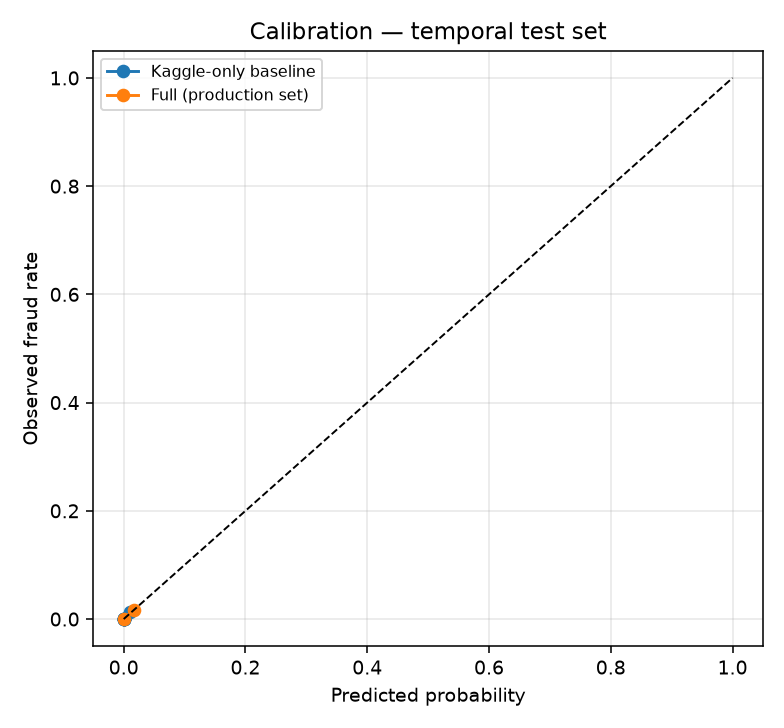

# Model Evaluation Report

Generated by `models/evaluate.py`. Rows: 284,807, fraud: 492. Unless stated otherwise: **LightGBM (no reweighting)** (production hyper-parameters; see H for why re-weighting is off), **temporal split** (train on the first 64 % of time, threshold chosen on the next 16 %, tested on the last 20 %). Cost saving = 1 − (missed fraud amount + 5 per alert reviewed) / total fraud amount.

## A. Random vs temporal split

| Setting | ROC-AUC | PR-AUC | Precision | Recall | F1 | Recall @0.1% FPR | Fraud amount caught % | Cost saving % |
|---|---|---|---|---|---|---|---|---|
| Kaggle-only, random split | 0.9838 | 0.8735 | 0.9286 | 0.7959 | 0.8571 | 0.8673 | 79.4 | 75.4 |
| Kaggle-only, temporal split | 0.9842 | 0.7876 | 0.9811 | 0.6933 | 0.8125 | 0.7867 | 51.9 | 48.4 |
| Full, random split | 1.0 | 1.0 | 1.0 | 0.9796 | 0.9897 | 1.0 | 99.7 | 95.2 |
| Full, temporal split | 1.0 | 1.0 | 1.0 | 0.9867 | 0.9933 | 1.0 | 100.0 | 95.2 |

## B. Feature sets

| Setting | ROC-AUC | PR-AUC | Precision | Recall | F1 | Recall @0.1% FPR | Fraud amount caught % | Cost saving % |
|---|---|---|---|---|---|---|---|---|
| Kaggle-only baseline | 0.9842 | 0.7876 | 0.9811 | 0.6933 | 0.8125 | 0.7867 | 51.9 | 48.4 |
| Synthetic-only | 1.0 | 1.0 | 1.0 | 0.9867 | 0.9933 | 1.0 | 100.0 | 95.2 |
| Full (production set) | 1.0 | 1.0 | 1.0 | 0.9867 | 0.9933 | 1.0 | 100.0 | 95.2 |

## C. Group contribution

**C1 — add one synthetic group to the Kaggle-only baseline**

| Setting | PR-AUC | ROC-AUC | Recall @0.1% FPR | PR-AUC gain |
|---|---|---|---|---|
| Kaggle + Time (synthetic) | 0.9188 | 0.9997 | 0.92 | 0.1312 |
| Kaggle + Behavioural | 1.0 | 1.0 | 1.0 | 0.2124 |
| Kaggle + Device | 0.9933 | 1.0 | 1.0 | 0.2057 |
| Kaggle + Geo/Location | 0.9993 | 1.0 | 1.0 | 0.2117 |
| Kaggle + Session | 1.0 | 1.0 | 1.0 | 0.2124 |
| Kaggle + Relationship | 1.0 | 1.0 | 1.0 | 0.2124 |
| Kaggle + Engineered | 0.9707 | 1.0 | 1.0 | 0.1831 |

**C2 — remove one synthetic group from the full set**

| Setting | PR-AUC | ROC-AUC | Recall @0.1% FPR | PR-AUC lost |
|---|---|---|---|---|
| Full - Time (synthetic) | 1.0 | 1.0 | 1.0 | 0.0 |
| Full - Behavioural | 1.0 | 1.0 | 1.0 | 0.0 |
| Full - Device | 1.0 | 1.0 | 1.0 | 0.0 |
| Full - Geo/Location | 1.0 | 1.0 | 1.0 | 0.0 |
| Full - Session | 1.0 | 1.0 | 1.0 | 0.0 |
| Full - Relationship | 1.0 | 1.0 | 1.0 | 0.0 |
| Full - Engineered | 1.0 | 1.0 | 1.0 | 0.0 |

## D. Model comparison

**Kaggle-only features**

| Setting | ROC-AUC | PR-AUC | Precision | Recall | F1 | Recall @0.1% FPR | Fraud amount caught % | Cost saving % | Fit (s) |
|---|---|---|---|---|---|---|---|---|---|
| Logistic Regression | 0.9856 | 0.7416 | 0.8793 | 0.68 | 0.7669 | 0.7867 | 57.3 | 53.5 | 0.5 |
| Random Forest | 0.9548 | 0.8107 | 0.8769 | 0.76 | 0.8143 | 0.7867 | 65.9 | 61.7 | 18.5 |
| XGBoost | 0.9739 | 0.79 | 0.8889 | 0.7467 | 0.8116 | 0.7733 | 53.0 | 48.9 | 1.8 |
| LightGBM (production: is_unbalance) | 0.6843 | 0.3149 | 0.5233 | 0.6 | 0.559 | 0.6 | 38.6 | 33.1 | 1.2 |
| LightGBM (no reweighting) | 0.9842 | 0.7876 | 0.9811 | 0.6933 | 0.8125 | 0.7867 | 51.9 | 48.4 | 1.5 |
| Isolation Forest | 0.9511 | 0.0387 | 0.0654 | 0.4267 | 0.1135 | 0.0 | 46.0 | 14.4 | 1.0 |

**Full features**

| Setting | ROC-AUC | PR-AUC | Precision | Recall | F1 | Recall @0.1% FPR | Fraud amount caught % | Cost saving % | Fit (s) |
|---|---|---|---|---|---|---|---|---|---|
| Logistic Regression | 1.0 | 1.0 | 1.0 | 1.0 | 1.0 | 1.0 | 100.0 | 95.1 | 0.5 |
| Random Forest | 1.0 | 1.0 | 1.0 | 0.9733 | 0.9865 | 1.0 | 100.0 | 95.3 | 8.1 |
| XGBoost | 1.0 | 1.0 | 1.0 | 0.9733 | 0.9865 | 1.0 | 99.9 | 95.2 | 1.8 |
| LightGBM (production: is_unbalance) | 1.0 | 1.0 | 1.0 | 1.0 | 1.0 | 1.0 | 100.0 | 95.1 | 1.4 |
| LightGBM (no reweighting) | 1.0 | 1.0 | 1.0 | 0.9867 | 0.9933 | 1.0 | 100.0 | 95.2 | 1.7 |
| Isolation Forest | 1.0 | 0.9608 | 0.9508 | 0.7733 | 0.8529 | 1.0 | 79.2 | 75.2 | 1.2 |

## E. Leakage audit (each feature on its own)

Strongest real (Kaggle) feature: **V14**, ROC-AUC 0.9492. **11 synthetic features beat it on their own** — a real-world signal this clean would be unusual, so these are leakage flags.

| Feature | Source | Single-feature AUC |
|---|---|---|
| risk_composite | synthetic | 1.0 |
| beneficiary_risk_score | synthetic | 0.9999 |
| typing_speed_anomaly | synthetic | 0.9993 |
| device_trust_score | synthetic | 0.9988 |
| session_risk_score | synthetic | 0.9956 |
| account_age_days | synthetic | 0.9955 |
| geo_distance_km | synthetic | 0.987 |
| geo_risk_score | synthetic | 0.9868 |
| active_hour_score | synthetic | 0.9857 |
| txn_count_24h | synthetic | 0.9727 |
| txn_count_1h | synthetic | 0.9721 |
| V14 | kaggle | 0.9492 |
| V4 | kaggle | 0.9383 |
| V12 | kaggle | 0.937 |
| V11 | kaggle | 0.9181 |

## F. Signal stress test (synthetic values replaced by label-independent noise)

| Setting | PR-AUC | ROC-AUC | Recall @0.1% FPR | Precision | Recall |
|---|---|---|---|---|---|
| 0% of synthetic values replaced | 1.0 | 1.0 | 1.0 | 1.0 | 0.9867 |
| 50% of synthetic values replaced | 1.0 | 1.0 | 1.0 | 1.0 | 0.9867 |
| 80% of synthetic values replaced | 0.8953 | 0.9892 | 0.8933 | 0.8158 | 0.8267 |
| 90% of synthetic values replaced | 0.812 | 0.9923 | 0.8133 | 0.8028 | 0.76 |
| 95% of synthetic values replaced | 0.8017 | 0.9861 | 0.8 | 0.8358 | 0.7467 |
| 100% of synthetic values replaced | 0.8013 | 0.9795 | 0.8 | 0.7703 | 0.76 |

Kaggle-only baseline PR-AUC for reference: 0.7876

## G. Calibration

| Model | Brier score | % of test frauds scored between 1 % and 99 % |
|---|---|---|
| Kaggle-only baseline | 0.000407 | 32.0 |
| Full (production set) | 1.03e-08 | 0.0 |

## H. Seed stability (Kaggle-only features, seeds 42, 7, 2024)

| Model | PR-AUC mean ± std | PR-AUC min – max | ROC-AUC mean ± std |
|---|---|---|---|
| LightGBM (production: is_unbalance) | 0.3689 ± 0.0461 | 0.3149 – 0.4276 | 0.7819 ± 0.0816 |
| LightGBM (no reweighting) | 0.787 ± 0.0031 | 0.783 – 0.7904 | 0.984 ± 0.0004 |
| XGBoost | 0.7934 ± 0.0025 | 0.79 – 0.7961 | 0.9756 ± 0.0026 |
